# Architecture

LearnByPlay is a single Next.js 16 application with a local SQLite database. There are no microservices, no message queues, and no external dependencies at runtime. That's a feature.

## System diagram

```mermaid
flowchart TB
    subgraph Browser
        UI[React 19 UI<br/>Server + Client Components]
    end

    subgraph "Next.js 16 App"
        Router[App Router]
        Pages[Server Components<br/>games, lessons, dashboard, tools]
        Actions[Server Actions<br/>actions.ts]
        API[Route Handlers<br/>/api/lessons/&#91;slug&#93;/pdf<br/>/api/health]
        Data[Data layer<br/>src/lib/data/*]
        PDF[pdf-lib<br/>renderer]
    end

    subgraph "Disk"
        SQLite[(SQLite<br/>data/learnbyplay.db)]
        Seed[Seed modules<br/>src/lib/seed/*]
    end

    UI -->|navigate| Router
    UI -->|form submit| Actions
    UI -->|fetch PDF| API
    Router --> Pages
    Pages --> Data
    Actions --> Data
    API --> Data
    API --> PDF
    Data <-->|better-sqlite3| SQLite
    Seed -.first boot.-> SQLite
```



## Layering

```
┌─────────────────────────────────────────────┐
│  Pages (src/app/**/page.tsx)                │  React Server Components
│  - Compose UI from data + components        │
├─────────────────────────────────────────────┤
│  Components (src/components/*)              │  Reusable UI
│  - Stateless where possible                 │
├─────────────────────────────────────────────┤
│  Server actions (src/app/actions.ts)        │  Mutations
│  - Validate, mutate, revalidate, redirect   │
├─────────────────────────────────────────────┤
│  Data layer (src/lib/data/*)                │  Queries
│  - One module per aggregate                 │
│  - Returns typed domain objects             │
├─────────────────────────────────────────────┤
│  Mappers (src/lib/data/mappers.ts)          │  Row → Domain
│  - JSON.parse the TEXT columns              │
├─────────────────────────────────────────────┤
│  DB connection (src/lib/db.ts)              │  Schema + seed
│  - Singleton better-sqlite3 instance        │
└─────────────────────────────────────────────┘
```

Rules:

- **Pages never call `getDb()` directly.** Always go through `src/lib/data/*`.
- **Mutations go through server actions.** Never expose SQL to client components.
- **All array/object game fields are stored as JSON TEXT in SQLite.** Mappers parse on read.

## Why SQLite

SQLite is the right database for LearnByPlay because:

- **Zero ops.** No daemon, no cluster, no failover. A teacher's laptop or a school's lone Linux box runs it fine.
- **Synchronous reads** (via `better-sqlite3`) integrate cleanly with React Server Components.
- **Transactional seeding.** `ON CONFLICT` upserts let the demo dataset refresh idempotently.
- **Backups are `cp`.** A nightly cron over the WAL file is sufficient for a school's risk profile.

If your deployment outgrows SQLite, the data layer is the only place that needs to change. The page and action layers are database-agnostic.

## Request lifecycle: logging a session

```mermaid
sequenceDiagram
    participant U as User
    participant B as Browser
    participant N as Next.js
    participant A as Server Action
    participant D as Data layer
    participant S as SQLite

    U->>B: Submit "Log session" form
    B->>N: POST (server action invocation)
    N->>A: logSessionAction(formData)
    A->>A: validateField for each field
    alt validation fails
        A-->>B: ActionState with errorFields
    else validation ok
        A->>D: getDb()
        D->>S: BEGIN; SELECT existence; INSERT; COMMIT
        S-->>D: rows
        A->>N: revalidatePath('/dashboard')
        A-->>B: redirect('/dashboard?logged=1')
    end
    B->>N: GET /dashboard
    N->>D: getDashboardSnapshot()
    D->>S: SELECT ... (aggregates)
    S-->>D: snapshot
    N-->>B: Server-rendered HTML
    B-->>U: Updated dashboard
```

## Why Next.js App Router

- **Server components** mean the SQLite query happens during render, on the server, with no client-side fetch waterfall.
- **Server actions** keep mutation logic in TypeScript without inventing an API contract for forms.
- **Streaming** + `loading.tsx` means the dashboard's skeleton renders instantly even on a slow database query.

## What we don't use

| Choice | Reason |
|--------|--------|
| No ORM | The schema is tiny. `better-sqlite3` prepared statements are clearer than an ORM abstraction. |
| No state library | Server components carry the data; client components stay local. |
| No CSS framework runtime | Tailwind 4 compiles to static CSS at build time. |
| No auth (yet) | Demo is single-tenant. See the roadmap for multi-teacher mode. |
