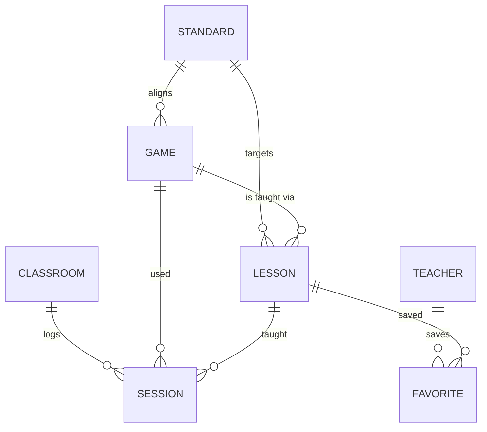

# Core concepts overview

LearnByPlay revolves around six primary nouns. Once you understand how they relate, every screen in the app makes sense.

## The nouns

### Standard
A specific learning target, identified by a code from a published framework. LearnByPlay ships with **Common Core Math** codes and **CASEL** SEL competencies. Every standard has a subject and a grade band.

### Game
A board, card, or tabletop game that practices one or more standards. Games carry the metadata teachers need to plan: publisher, age range, players, play time, complexity (1–5), mechanics, materials, and a `classroomFit` blurb.

### Lesson plan
A teaching script that uses a specific game to hit specific standards. Lessons have a fixed shape — objectives, pre-game, facilitation, post-game reflection, rubric, variants — so every plan in the library feels like every other plan.

### Classroom
A class roster. Just a name, subject, grade band, and student count. LearnByPlay is intentionally not a gradebook.

### Session
An event: "Period 3 Math played Fraction Tracks with the equivalent-fractions lesson on Jan 15." Sessions are how evidence accumulates.

### Favorite
A bookmark on a lesson, scoped to a teacher name. Drives the "Favorite lessons" row on the dashboard.

## How they connect

The loop in production:

1. A **standard** has many aligned **games** and many **lessons**.
2. A **game** can support many **lessons** (different durations, different focuses).
3. A **lesson** is run as a **session** in a **classroom**.
4. Logged **sessions** roll up into the dashboard's **skill heatmap** and **standards coverage**.

## What's *not* a concept

We deliberately don't model:

- **Students** by name (other than the in-tab group generator buffer).
- **Grades** or scores.
- **Attendance**.
- **Assignments** or homework.

LearnByPlay is the *evidence layer* on top of your existing classroom systems. It tells you and your admin **which standards each class practiced**, not who got an 87 on the quiz.

## Deeper dives

- [Games and standards](./games-and-standards) — how alignment actually works.
- [Lesson plans](./lesson-plans) — anatomy of a plan and its variants.
- [Classroom tools](./classroom-tools) — group generator, timer, rules viewer.
- [Dashboard and data](./dashboard-and-data) — sessions, favorites, heatmaps.
- [Architecture](./architecture) — how the pieces fit at the code level.
