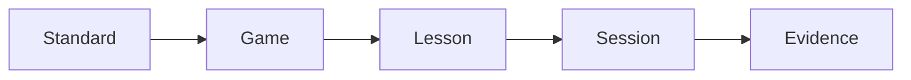

# Your first lesson, end to end

Goal: in 5 minutes, go from a freshly installed LearnByPlay to a logged classroom session with evidence in the dashboard.

This walkthrough assumes you finished the [Quickstart](./quickstart) and have the dev server running at `http://localhost:3000`.

## Step 1 — Pick a standard

Open **[http://localhost:3000/games](http://localhost:3000/games)**.

Use the filter sidebar:

- **Subject**: Math
- **Grade band**: 3–5
- **Max complexity**: 3 (Moderate)

You'll see a filtered grid of games. Each card shows publisher, play time, group size, and the standards it touches.

## Step 2 — Open a game

Click into any card — for example, **Fraction Tracks**.

The game detail page shows:

- **Standards alignment** (e.g. `CCSS.MATH.3.NF.A.3`)
- **Skills practiced** (e.g. equivalent fractions, number-line reasoning)
- **Linked lesson plans**
- **Materials and copies notes** (how many copies you need for a class of 28)
- **Simplified rules** for the classroom

## Step 3 — Open the lesson plan

Click **Lesson: Fraction Tracks — Equivalent Fractions on a Line**.

You'll see a full plan:

| Section | Contents |
|---------|----------|
| Learning objectives | 3–5 SWBAT statements |
| Materials needed | Game copies, whiteboards, a printable recording sheet |
| Pre-game activity | A 5-minute warm-up to anchor prior knowledge |
| Facilitation guide | Phase-by-phase moves while students play |
| Post-game reflection | Whole-class discussion prompts |
| Rubric | Exceeds / Meets / Developing rows for each criterion |
| Duration variants | 30 / 45 / 60-minute versions of the same lesson |

Click **Download PDF**. You should get a clean, print-ready PDF — no LearnByPlay chrome, just the plan.

## Step 4 — Set up your class

Open **[http://localhost:3000/dashboard](http://localhost:3000/dashboard)**.

Click **Add classroom**:

- **Name**: `Period 3 Math`
- **Subject**: `Math`
- **Grade band**: `3-5`
- **Student count**: `24`

Submit. You're back on the dashboard with a new class card.

## Step 5 — Run the session (simulated)

Open **[http://localhost:3000/tools](http://localhost:3000/tools)** in a second tab.

- **Group generator**: Enter 24 student names (or paste any list) and pick groups of 4. You get six balanced groups instantly.
- **Session timer**: Set phases — `Setup (5 min)`, `Round 1 (10 min)`, `Reflection (5 min)`. Start the timer. It announces each phase change.
- **Rules viewer**: Open Fraction Tracks. Read the simplified rules with the class.

In a real classroom, students play through the lesson. For this walkthrough, just close the tools tab.

## Step 6 — Log the session

Back on the dashboard, click **Log session**:

- **Classroom**: `Period 3 Math`
- **Game**: `Fraction Tracks`
- **Lesson**: `Fraction Tracks — Equivalent Fractions on a Line`
- **Date**: today
- **Notes**: `Strong engagement. Most groups landed equivalent fractions on the number line; two groups need a follow-up.`

Submit. The dashboard updates:

- **Session count** ticks up.
- The **skill heatmap** lights up cells for `equivalent fractions` and `number-line reasoning`.
- **Standards covered** increases.

## What you just did

You walked the entire LearnByPlay loop in five minutes:

Every action you took produces evidence that survives in the dashboard. When a principal asks *"What standards has Period 3 practiced this month?"* you have an answer in two clicks.

## Next steps

- **[Core Concepts → Overview](../concepts/overview)** — the mental model behind these screens.
- **[Guides → Running a classroom session](../guides/running-a-classroom-session)** — what to do differently with real students in the room.
- **[Guides → Finding games by standard](../guides/finding-games-by-standard)** — the filtering patterns that scale to a full year of planning.
