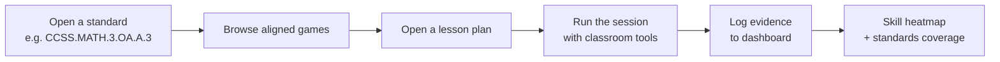

# Welcome to LearnByPlay

**LearnByPlay turns great board games into trusted, standards-aligned classroom instruction.**

It's an open-source web app for K–12 teachers who want the proven engagement of tabletop games without giving up the rigor their administrators expect. Browse a curated catalog by Common Core code, open a full lesson plan, run the session with built-in classroom tools, and log evidence to your dashboard — all in one place.

## What you get

- **A curated catalog of 45 educational board games**, each tagged with standards, skills, grade band, complexity, group size, and play time.
- **21 ready-to-teach lesson plans** with learning objectives, pre-game activities, facilitation guides, rubrics, reflection prompts, and PDF export.
- **Live classroom tools**: random group generator, phased session timer, simplified rules viewer.
- **A teacher dashboard** with class rosters, session logs, favorites, and a skill-coverage heatmap.
- **A professional development library** with articles and an administrator FAQ.

## Who it's for

| Audience | What LearnByPlay solves |
|----------|------------------------|
| **Classroom teachers** | "I know this game is fun — but I need to justify it to my principal." |
| **Instructional coaches** | "I want a shared, standards-mapped library teachers actually use." |
| **Administrators** | "Show me which standards each class practiced this quarter." |
| **Homeschool parents** | "I have the games. I just need the lesson plans." |

## How it works

Open the standard, pick the game, run the lesson, log the outcome. That's the whole loop — and every step is already built for you.

## Get started

- **[5-minute Quickstart](./getting-started/quickstart)** — clone, run, browse.
- **[Your first lesson](./getting-started/first-lesson-in-5-minutes)** — go from zero to a logged session.
- **[Why LearnByPlay?](./why)** — how it compares to spreadsheets, BoardGameGeek lists, and DIY lesson docs.

## License and source

LearnByPlay is MIT-licensed and developed on GitHub at [TabletopFoundry/learnbyplay](https://github.com/TabletopFoundry/learnbyplay). Issues, discussions, and pull requests are welcome.
