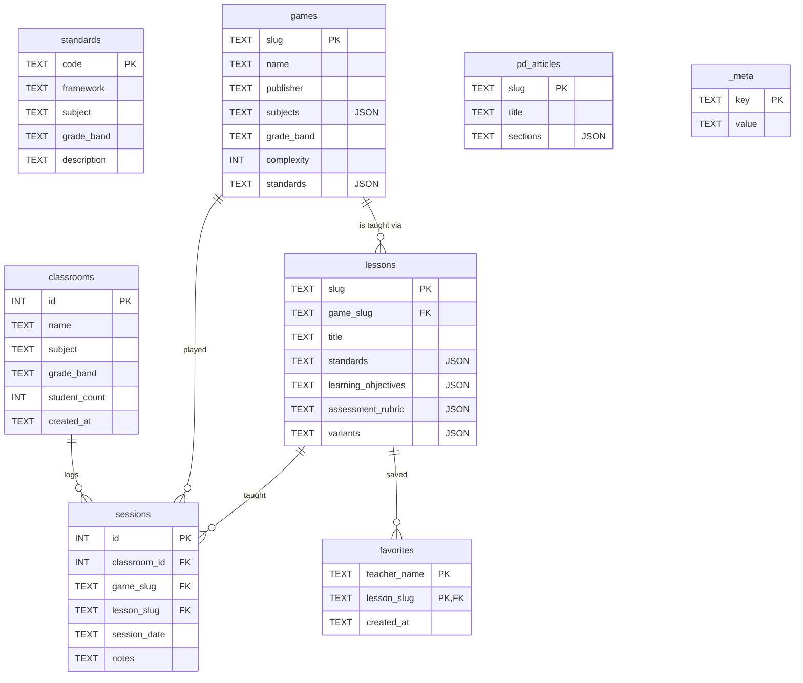

# Data model

The SQLite schema is defined in `src/lib/db.ts`. Eight tables.

## Schema diagram



## Tables

### `standards`

| Column | Type | Notes |
|--------|------|-------|
| `code` | TEXT PK | e.g. `CCSS.MATH.3.NF.A.3` |
| `framework` | TEXT | `Common Core`, `CASEL`, ... |
| `subject` | TEXT | One of the SUBJECTS or `Advisory` |
| `grade_band` | TEXT | `K-2`, `3-5`, `6-8`, `9-12` |
| `description` | TEXT | Verbatim standard text |

### `games`

Stored mostly as JSON-encoded TEXT for arrays:

| Column | Type | Notes |
|--------|------|-------|
| `slug` | TEXT PK | URL-safe id |
| `name`, `publisher`, `tagline`, `description` | TEXT | |
| `subjects` | TEXT (JSON array) | |
| `grade_band` | TEXT | |
| `age_range` | TEXT | `"8+"` |
| `min_players`, `max_players` | INTEGER | |
| `play_time_min`, `play_time_max` | INTEGER (minutes) | |
| `complexity` | INTEGER 1–5 | |
| `setup_time_min` | INTEGER | |
| `mechanics`, `skills`, `materials`, `simplified_rules`, `standards` | TEXT (JSON arrays) | |
| `classroom_fit`, `copies_note` | TEXT | |

### `lessons`

| Column | Type | Notes |
|--------|------|-------|
| `slug` | TEXT PK | |
| `game_slug` | TEXT FK → games | |
| `title`, `summary` | TEXT | |
| `grade_band` | TEXT | |
| `standards` | TEXT (JSON) | Must be ⊆ game's standards |
| `learning_objectives`, `materials_needed`, `pre_game_activity`, `facilitation_guide`, `post_game_reflection`, `teacher_prep` | TEXT (JSON arrays) | |
| `assessment_rubric` | TEXT (JSON `RubricRow[]`) | |
| `variants` | TEXT (JSON `LessonVariant[]`) | |

### `classrooms`

| Column | Type | Notes |
|--------|------|-------|
| `id` | INTEGER PK AUTOINCREMENT | |
| `name`, `subject`, `grade_band` | TEXT | |
| `student_count` | INTEGER | |
| `created_at` | TEXT (ISO date) | |

### `sessions`

| Column | Type | Notes |
|--------|------|-------|
| `id` | INTEGER PK AUTOINCREMENT | |
| `classroom_id` | INTEGER FK ON DELETE CASCADE | |
| `game_slug` | TEXT FK → games | |
| `lesson_slug` | TEXT FK → lessons | |
| `session_date` | TEXT | |
| `notes` | TEXT (default `""`) | |

### `favorites`

| Column | Type | Notes |
|--------|------|-------|
| `teacher_name` | TEXT PK | |
| `lesson_slug` | TEXT PK FK → lessons | |
| `created_at` | TEXT | |

### `_meta`

Key-value store used for seed versioning and small flags.

## Why TEXT-as-JSON?

Most game/lesson fields are arrays of short strings (mechanics, skills, materials). Options were:

1. **Junction tables** — formally correct but explodes the query count.
2. **TEXT-as-JSON** — one column read, parsed in the mapper layer.

Given the read pattern (load a game → render everything about it), option 2 wins on simplicity and is fine at this scale (≤ 1000 games).

## The mapper pattern

Reads go through `src/lib/data/mappers.ts`:

```ts
function rowToGame(row: GameRow): Game {
  return {
    ...row,
    subjects: JSON.parse(row.subjects),
    mechanics: JSON.parse(row.mechanics),
    skills: JSON.parse(row.skills),
    // ...
  };
}
```

Pages never see raw rows. Pages always see typed domain objects.

## Adding a new table

If you need a new aggregate (e.g. observation notes):

1. Add the DDL to the `CREATE TABLE IF NOT EXISTS ...` block in `src/lib/db.ts`.
2. Add a data module in `src/lib/data/observations.ts`.
3. If it has writes, add server actions in `src/app/actions.ts` with validation.
4. Bump `SEED_VERSION` if seeded.

There is no migrations framework — schema is idempotent (`CREATE TABLE IF NOT EXISTS`) and the seed runner upserts. For destructive changes, write a one-off migration block guarded by `_meta.schema_version`.
